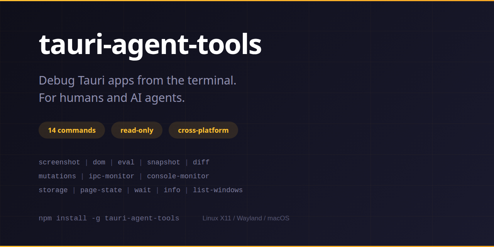

<div align="center">

# tauri-agent-tools

**Agent-driven inspection toolkit for Tauri desktop apps**

38 commands to screenshot, inspect, interact with, monitor, post-mortem, audit, and diagnose Tauri apps from the CLI.

[](https://github.com/cesarandreslopez/tauri-agent-tools/actions/workflows/ci.yml)
[](https://www.npmjs.com/package/tauri-agent-tools)
[](https://www.npmjs.com/package/tauri-agent-tools)
[](LICENSE)
[](https://nodejs.org)



</div>

## The Problem

Debugging frontend issues in Tauri desktop apps requires manually screenshotting, cropping, and describing what you see. Existing tools either hijack your cursor (xcap-based), render DOM to canvas (html2canvas — can't capture WebGL/video/canvas), or have no authentication.

## The Solution

Combine a bridge's knowledge of element positions (`getBoundingClientRect`) with real pixel screenshots (`import -window` + ImageMagick crop). No other tool does this.

```bash
# Screenshot a specific DOM element with real pixels
tauri-agent-tools screenshot --selector ".wf-toolbar" -o /tmp/toolbar.png
tauri-agent-tools screenshot --selector "#canvas-area" -o /tmp/canvas.png

# Explore DOM structure first
tauri-agent-tools dom --depth 3
tauri-agent-tools dom ".wf-canvas" --depth 4

# Then screenshot what you found
tauri-agent-tools screenshot --selector ".wf-canvas .block-node" -o /tmp/block.png
```

## Install

```bash
npm install -g tauri-agent-tools
```

**System requirements:**
- **Linux X11:** `xdotool`, `imagemagick` (`sudo apt install xdotool imagemagick`)
- **Linux Wayland/Sway:** `swaymsg`, `grim`, `imagemagick`
- **Linux Wayland/Hyprland:** `hyprctl` (included with Hyprland), `grim`, `imagemagick`
- **macOS:** `imagemagick` (`brew install imagemagick`) — all other tools are built-in. Grant Screen Recording permission in System Settings → Privacy & Security → Screen Recording.

## Quick Start

### 1. Add the bridge to your Tauri app

See [rust-bridge/README.md](rust-bridge/README.md) for step-by-step integration.

The bridge runs a localhost-only, token-authenticated HTTP server during development. It auto-cleans up on exit.

### 2. Use the CLI

```bash
# DOM-targeted screenshot (needs bridge)
tauri-agent-tools screenshot --selector ".toolbar" -o /tmp/toolbar.png
tauri-agent-tools screenshot --selector "#main-canvas" --max-width 800 -o /tmp/canvas.png

# Full window screenshot (no bridge needed, works with any window)
tauri-agent-tools screenshot --title "My App" -o /tmp/full.png

# Explore DOM
tauri-agent-tools dom --depth 3
tauri-agent-tools dom ".sidebar" --depth 2 --styles

# Evaluate JS
tauri-agent-tools eval "document.title"
tauri-agent-tools eval "document.querySelectorAll('.item').length"

# Wait for conditions
tauri-agent-tools wait --selector ".toast-message" --timeout 5000
tauri-agent-tools wait --title "My App" --timeout 10000

# Window info
tauri-agent-tools info --title "My App" --json
```

## Commands

### `screenshot`

Capture a screenshot of a window or DOM element.

| Option | Description |
|--------|-------------|
| `-s, --selector <css>` | CSS selector — screenshot just this element (requires bridge) |
| `-t, --title <regex>` | Window title to match — regex; quote titles with spaces |
| `-w, --window-id <id>` | Platform window id (from `list-windows`) — overrides `--title` |
| `-o, --output <path>` | Output file path (default: auto-named) |
| `--format <png\|jpg>` | Output format (default: png) |
| `--max-width <number>` | Resize to max width |
| `--port <number>` | Bridge port (auto-discover if omitted) |
| `--token <string>` | Bridge token (auto-discover if omitted) |

### `dom`

Query DOM structure from the Tauri app.

| Option | Description |
|--------|-------------|
| `[selector]` | Root element to explore (default: body) |
| `--mode <mode>` | Output mode: `dom` (default) or `accessibility` |
| `--depth <number>` | Max child depth (default: 3) |
| `--tree` | Compact tree view (default) |
| `--styles` | Include computed styles |
| `--text <pattern>` | Find elements containing this text (case-insensitive) |
| `--count` | Just output match count |
| `--first` | Only return first match |
| `--json` | Full structured JSON output |

### `eval`

Evaluate a JavaScript expression in the Tauri app.

```bash
tauri-agent-tools eval "document.title"
tauri-agent-tools eval --file script.js
```

| Option | Description |
|--------|-------------|
| `<js-expression>` | Inline JavaScript to evaluate |
| `--file <path>` | Load JavaScript from a file instead |
| `--window-label <label>` | Target a specific webview window (default: main) |

### `wait`

Wait for a condition to be met.

| Option | Description |
|--------|-------------|
| `-s, --selector <css>` | Wait for CSS selector to match |
| `-e, --eval <js>` | Wait for JS expression to be truthy |
| `-t, --title <regex>` | Wait for window with title (no bridge) |
| `--timeout <ms>` | Maximum wait time (default: 10000) |
| `--interval <ms>` | Polling interval (default: 500) |

### `info`

Show window geometry and display server info.

```bash
tauri-agent-tools info --title "My App" --json
tauri-agent-tools info --window-id 12345678   # id from list-windows, skips title search
```

### `list-windows`

List all visible windows, marking Tauri apps.

| Option | Description |
|--------|-------------|
| `--json` | Output as JSON |
| `--tauri` | Only show Tauri app windows |

### `ipc-monitor`

Monitor Tauri IPC calls in real-time (read-only). Monkey-patches Tauri's invoke API (`window.__TAURI_INTERNALS__.invoke`, falling back to `window.__TAURI__.core.invoke`) to capture calls, then polls and restores on exit.

| Option | Description |
|--------|-------------|
| `--filter <command>` | Only show specific IPC commands (supports `*` wildcards) |
| `--interval <ms>` | Poll interval in milliseconds (default: 500) |
| `--duration <ms>` | Auto-stop after N milliseconds |
| `--json` | Output one JSON object per line |

### `console-monitor`

Monitor console output (log/warn/error/info/debug) in real-time. Monkey-patches console methods to capture entries, then polls and restores on exit.

| Option | Description |
|--------|-------------|
| `--level <level>` | Filter by level (log, warn, error, info, debug) |
| `--filter <regex>` | Filter messages by regex pattern |
| `--interval <ms>` | Poll interval in milliseconds (default: 500) |
| `--duration <ms>` | Auto-stop after N milliseconds |
| `--json` | Output one JSON object per line |

### `storage`

Inspect localStorage, sessionStorage, and cookies from the Tauri webview. One-shot read — no writes.

| Option | Description |
|--------|-------------|
| `--type <type>` | Storage type: `local`, `session`, `cookies`, `all` (default: all) |
| `--key <name>` | Get a specific key's value |
| `--json` | Output as JSON |

### `page-state`

Query webview page state: URL, title, viewport, scroll position, document size, and Tauri detection.

| Option | Description |
|--------|-------------|
| `--json` | Output as JSON |

### `diff`

Compare two screenshots and output difference metrics.

| Option | Description |
|--------|-------------|
| `<image1>` | First image path |
| `<image2>` | Second image path |
| `-o, --output <path>` | Diff image output path |
| `--threshold <percent>` | Fail (exit code 1) if difference exceeds this percentage |
| `--json` | Output structured JSON |

### `mutations`

Watch DOM mutations on a CSS selector (read-only). Patches a `MutationObserver` into the webview, polls for changes, and cleans up on exit.

| Option | Description |
|--------|-------------|
| `<selector>` | CSS selector of the element to observe |
| `--attributes` | Also watch attribute changes |
| `--interval <ms>` | Poll interval in milliseconds (default: 500) |
| `--duration <ms>` | Auto-stop after N milliseconds |
| `--json` | Output one JSON object per line |

### `snapshot`

Capture screenshot + DOM tree + page state + storage in one shot. Writes multiple files with a shared prefix.

| Option | Description |
|--------|-------------|
| `-o, --output <prefix>` | Output path prefix (e.g. `/tmp/debug`) |
| `-s, --selector <css>` | CSS selector to screenshot (full window if omitted) |
| `-t, --title <regex>` | Window title to match — regex; quote titles with spaces (default: auto-discover) |
| `-w, --window-id <id>` | Platform window id (from `list-windows`) — overrides `--title` |
| `--dom-depth <number>` | DOM tree depth (default: 3) |
| `--eval <js>` | Additional JS to eval and save |
| `--json` | Output structured manifest |

### `rust-logs`

Monitor Rust backend logs and sidecar output in real-time. Unlike `console-monitor` (which captures JavaScript console output), this captures Rust `tracing`/`log` output and sidecar process stdout/stderr via the bridge's `/logs` endpoint.

| Option | Description |
|--------|-------------|
| `--level <level>` | Minimum log level: `trace`, `debug`, `info`, `warn`, `error` |
| `--target <regex>` | Filter by Rust module path (e.g. `myapp::db`) |
| `--source <source>` | Filter by source: `rust`, `sidecar`, `all`, or `sidecar:<name>` (default: all) |
| `--filter <regex>` | Filter messages by regex pattern |
| `--interval <ms>` | Poll interval in milliseconds (default: 500) |
| `--duration <ms>` | Auto-stop after N milliseconds |
| `--json` | Output one JSON object per line |

### Interaction Commands

Interaction commands dispatch DOM events inside the webview. They require the dev bridge (debug builds only).

| Command | Description |
|---------|-------------|
| `click <selector>` | Click a DOM element (`--double`, `--right`, `--wait <ms>`) |
| `type <selector> <text>` | Type text into an input (`--clear` to empty first) |
| `scroll` | Scroll window or element (`--by <px>`, `--to-top`, `--to-bottom`, `--into-view`) |
| `focus <selector>` | Focus a DOM element |
| `navigate <target>` | Navigate within the app (route path or URL) |
| `select <selector> [value]` | Select dropdown value or toggle checkbox (`--toggle`) |
| `invoke <command> [args-json]` | Invoke a Tauri IPC command |

### Workflow Commands

| Command | Description |
|---------|-------------|
| `probe` | Discover running bridges, check health, list windows. With no explicit `--port`/`--token`/`--pid` and no bridge discoverable, reports instead of throwing (`target.alive=false` plus an actionable note, so callers can branch on the JSON) |
| `capture -o <dir>` | Full debug evidence bundle (screenshot, DOM, page state, storage, console errors, Rust logs) |
| `check` | Structured assertions (`--selector`, `--text`, `--eval`, `--no-errors`) — exits 0/1 |
| `store-inspect` | Inspect reactive store state (Pinia, Vue devtools, custom hooks) |

`capture`'s pipeline is also callable as a library: `captureToDir(bridge, adapter, opts)` returns the `CaptureManifest`. Deep-import it from `tauri-agent-tools/dist/commands/capture.js` — there is no package-root library entry point (the root is the CLI).

### Targeting Flags

All bridge-dependent commands support:

| Flag | Description |
|------|-------------|
| `--port <n>` / `--token <s>` | Explicit bridge config (skips auto-discovery) |
| `--pid <n>` | Target a specific app by PID |
| `--window-label <label>` | Target a specific webview window (default: main) |

## Don't know where to start? `diagnose`

When something's wrong and you're not sure why, run this first:

```bash
tauri-agent-tools diagnose --config ./src-tauri -o ./diagnose-out
# → ./diagnose-out/summary.md   (master report with "Next steps")
# → ./diagnose-out/forensics/   (Tier 1 bundle: log tail, panics, paths)
# → ./diagnose-out/bridge.json  (Tier 2 bridge data when reachable)
```

`diagnose` is a best-effort super-command. It works on dead apps. It layers bridge data on top when a dev bridge is reachable, degrades cleanly when not, and the master `summary.md` includes a "Next steps" section pointing at the right deeper command. Pass `--no-bridge` to skip the bridge phase entirely.

See [`docs/troubleshooting/decision-tree.md`](docs/troubleshooting/decision-tree.md) for the full symptom → command flowchart.

## Bridge-extending diagnostics (new in 0.7, requires bridge v0.7.0+)

Four commands that talk to new dev-bridge endpoints. Each feature-detects via `GET /version` and surfaces an actionable upgrade error when the bridge is older than v0.7.0.

```bash
# Tauri PID + registered sidecars (--deep walks the full OS descendant tree, no bridge needed)
tauri-agent-tools process-tree --json
tauri-agent-tools process-tree --deep --json

# Live capability audit (vs. config inspect which reads JSON files)
tauri-agent-tools capabilities audit --json

# Webview inspector URL or platform hint
tauri-agent-tools webview attach --print-url
tauri-agent-tools webview attach --open

# Quick "is this app sick" check — exits non-zero when unhealthy (CI-friendly)
tauri-agent-tools health --json
```

> **Integrators upgrading from v0.6:** Re-copy `examples/tauri-bridge/src/dev_bridge.rs` into your app. `start_bridge` now returns a third tuple element (`SidecarRegistry`); pass it to `spawn_sidecar_monitored` so sidecars show up in `process-tree`/`health`. See `.agents/skills/tauri-bridge-setup/SKILL.md` for the full upgrade walkthrough.

## Bridge-free diagnostics (new in 0.7)

Six commands that work **without** the dev bridge — for release builds, dead apps, and sidecar processes that the bridge can't reach.

```bash
# Resolve Tauri 2's OS data/log/cache/config dirs from tauri.conf.json
tauri-agent-tools app-paths --config ./src-tauri --json
tauri-agent-tools app-paths --identifier com.example.app --platform all --exists

# Structured "tauri info --json" + capability/permission audit
tauri-agent-tools config inspect --config ./src-tauri --json
# Warnings: wildcard permissions, fs:allow-all, capability/Cargo.toml plugin mismatches

# Tail OS logs filtered to a Tauri bundle id (NDJSON envelopes)
tauri-agent-tools os-logs --identifier com.example.app --duration 5000
tauri-agent-tools os-logs --level error --source main --duration 30000

# Wrap a sidecar, frame its stdout as NDJSON, validate against a JSON Schema
tauri-agent-tools sidecar tap --schema ./schema.json --record /tmp/run.ndjson -- node my-sidecar.js
# Replay the recording deterministically — to stdout or into a fresh sidecar's stdin
tauri-agent-tools sidecar replay /tmp/run.ndjson --to-exec node my-sidecar.js --rate 100
tauri-agent-tools sidecar replay /tmp/ipc-tap.ndjson --tap-format --dir out   # (new in 0.9) unwrap {dir,ts,line} tap rows, replay one direction

# Forensic bundle for post-crash analysis (composes the above; works on dead apps)
tauri-agent-tools forensics --config ./src-tauri -o ./forensics-out
# → ./forensics-out/{summary.md,summary.json,project.json,app-log-tail.txt,live-os-log.ndjson}
```

When to reach for them:
- **The bridge isn't responding** → start with `forensics`.
- **A sidecar is the suspect** → run it under `sidecar tap` instead of under Tauri.
- **You don't have source on hand, just a bundle id** → `app-paths --identifier com.example.app`.

## Unified logs and incident bundles (new in 0.8)

When you need the *whole* picture — every log line in order, or a single shareable archive of an incident:

```bash
# Merge on-disk tauri-plugin-log files + the live bridge /logs ring buffer into one
# timestamp-ordered stream (UTC-normalized). NDJSON by default; --pretty for humans.
tauri-agent-tools logs --config ./src-tauri --pretty
tauri-agent-tools logs --level warn --correlate          # filter + infer run_id/requestId ids
tauri-agent-tools logs --no-bridge                       # on-disk files only (no running app)

# Tail live bridge logs until interrupted (new in 0.9; v0.8 bridge: non-draining
# cursor reads — older bridges degrade to drain polling every --interval ms, default 2000)
tauri-agent-tools logs --follow --level warn

# Collect a shareable incident bundle: merged logs + deep process tree + app-paths +
# forensics (+ optional UI capture) → a redacted directory and a .tar.gz.
tauri-agent-tools bundle --config ./src-tauri -o ./incident --since 10m
tauri-agent-tools bundle --with-capture                  # also snapshot the UI (needs live bridge)
```

`logs` works with no bridge (it reads the on-disk log files); a running bridge just adds the live ring buffer. `bundle` redacts secrets (tokens, API keys, passwords, JWTs, AWS keys) and PII (emails, IPs, phone numbers, home paths — including base64-encoded ones) from artifacts on write; `.json`/`.ndjson` artifacts stay parseable, unredacted images are flagged as warnings, and it degrades cleanly when a phase can't run.

## How It Works

```
screenshot --selector ".toolbar" --title "My App"
  │
  ├─► Bridge client ──► POST /eval ──► getBoundingClientRect(".toolbar")
  │                                     returns { x, y, width, height }
  │
  ├─► Platform adapter ──► import -window WID png:- (capture full window)
  │
  ├─► Compute crop region:
  │     element rect from bridge + viewport offset (outerHeight - innerHeight)
  │
  └─► ImageMagick crop: png:- -crop WxH+X+Y +repage png:-
```

The crop accounts for window decoration (title bar, borders) by comparing `window.innerHeight` from the bridge with the actual window height from `xdotool`.

## Platform Support

| Platform | Display Server | Status |
|----------|---------------|--------|
| Linux | X11 | Supported |
| Linux | Wayland (Sway) | Supported |
| Linux | Wayland (Hyprland) | Supported |
| macOS | CoreGraphics | Supported |
| Windows | - | Planned |

## Design Decisions

### Inspection is read-only, interaction is debug-only

Inspection commands (screenshot, dom, eval, storage, etc.) are strictly read-only — they never modify app state. Interaction commands (click, type, scroll, focus, navigate, select, invoke) use eval-based DOM event dispatch and **only work with the dev bridge** (debug builds). Native input injection (xdotool, Accessibility API) is deliberately avoided:

- **Native input is system-wide and risky.** X11 injection operates globally, not per-window — it can grab the cursor and require a hard reboot.
- **Eval-based dispatch is per-window and sandboxed.** Interaction commands dispatch DOM events inside the webview via the bridge. They can't affect other apps or the OS.
- **Debug-only by design.** The bridge is compiled out of release builds (`cfg!(debug_assertions)`), so interaction commands cannot run against production apps.

### Why no MCP server mode

This tool is a CLI that runs commands and exits — not a persistent MCP server. Reasons:

- **No daemon to manage.** No port to monitor, no process to restart, no state to leak between sessions.
- **No `.mcp.json` auto-start risk.** MCP servers start automatically when a project opens in supporting editors. A dev tool that auto-starts and connects to your running app on project open is a footgun.
- **No transport complexity.** No WebSocket/stdio state machine, no reconnection logic, no transport-layer bugs.
- **Composable with any agent framework.** Commands return structured output (`--json`) that any tool-use system can call directly. Define each command as a tool — no MCP SDK dependency required.

## Safety Guarantees

- **No native input injection** — no xdotool type/mousemove, no Accessibility API sends. Interaction commands use eval-based DOM dispatch inside the webview only.
- **No xcap crate** — uses `xdotool` + ImageMagick (read-only X11 operations)
- **No daemon** — CLI runs and exits, no background processes
- **No `.mcp.json`** — never auto-starts
- **Inspection commands are read-only** — `xdotool search`, `getwindowgeometry`, `import -window`
- **Interaction commands are debug-only** — require the dev bridge, compiled out of release builds
- **Token authenticated bridge** — random 32-char token, localhost-only
- **`execFile` (array args)** — never `exec` (shell string), prevents command injection
- **Window ID validated** — must match `/^\d+$/`

## Agent Integration

This package ships [Agent Skills](https://agentskills.io) so AI coding agents can automatically learn how to use the CLI and set up the bridge.

| Skill | Description |
|-------|-------------|
| `tauri-agent-tools` | Using all 38 CLI commands to inspect and interact with Tauri apps |
| `tauri-bridge-setup` | Adding the Rust dev bridge to a Tauri project |
| `tauri-debug-quickstart` | First-30-seconds triage — pick the right command for the symptom |

<details>
<summary><strong>Claude Code</strong></summary>

Claude Code auto-discovers skills from `.agents/skills/` in the current project. If you installed `tauri-agent-tools` globally and want skills available everywhere:

```bash
cp -r "$(npm root -g)/tauri-agent-tools/.agents" ~/.agents
```
</details>

<details>
<summary><strong>Codex</strong></summary>

Codex reads `AGENTS.md` at the repo root and skills from `node_modules`. Install locally:

```bash
npm install tauri-agent-tools
```

Codex will pick up `AGENTS.md` and `.agents/skills/` automatically.
</details>

<details>
<summary><strong>Cursor / VS Code Copilot</strong></summary>

Copy skills into your project so the agent can discover them:

```bash
cp -r node_modules/tauri-agent-tools/.agents .agents
```

Or if installed globally:

```bash
cp -r "$(npm root -g)/tauri-agent-tools/.agents" .agents
```
</details>

<details>
<summary><strong>Other agents</strong></summary>

Any [agentskills.io](https://agentskills.io)-compatible agent can read the skills from `.agents/skills/` in this package. Install globally or locally and point the agent at the skill directory.
</details>

## Documentation

Full documentation is available at the [docs site](https://cesarandreslopez.github.io/tauri-agent-tools/):

- [Installation](https://cesarandreslopez.github.io/tauri-agent-tools/getting-started/installation/) — system requirements and setup
- [Quick Start](https://cesarandreslopez.github.io/tauri-agent-tools/getting-started/quick-start/) — get running in 5 minutes
- [Bridge Setup](https://cesarandreslopez.github.io/tauri-agent-tools/getting-started/bridge-setup/) — integrate the Rust bridge into your Tauri app
- [Command Reference](https://cesarandreslopez.github.io/tauri-agent-tools/commands/) — all 38 commands with examples
- [Platform Support](https://cesarandreslopez.github.io/tauri-agent-tools/platform-support/) — X11, Wayland, macOS details
- [Architecture](https://cesarandreslopez.github.io/tauri-agent-tools/architecture/overview/) — how it works under the hood

## Development

```bash
npm install
npm run build
npm test
```

## Contributing

Contributions are welcome! See [CONTRIBUTING.md](CONTRIBUTING.md) for:

- Development setup and prerequisites
- Code style and conventions
- Branch naming and commit message format
- Pull request process

## Community

- [Open an issue](https://github.com/cesarandreslopez/tauri-agent-tools/issues) for bugs or feature requests
- Star the repo if you find it useful

## License

MIT
