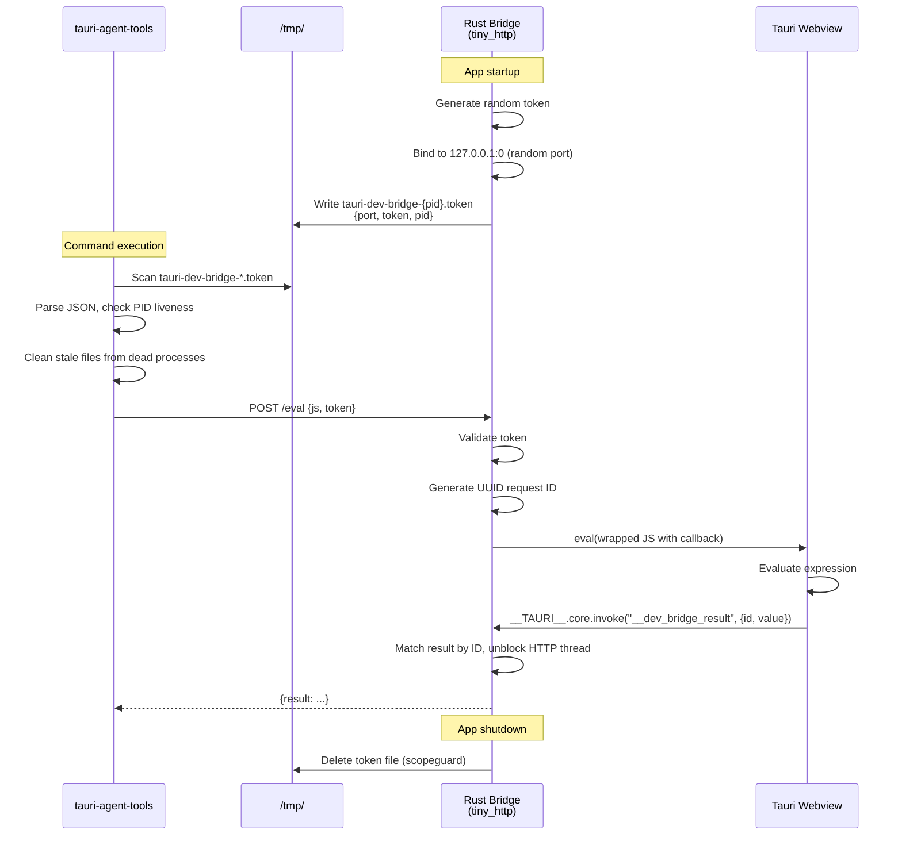

# Bridge Protocol

The bridge is a lightweight HTTP server embedded in the Tauri app during development. It enables tauri-agent-tools to evaluate JavaScript in the webview.

## Endpoints

The bridge exposes four HTTP endpoints:

| Endpoint | Method | Auth | Purpose |
|----------|--------|------|---------|
| `/eval` | POST | token | Evaluate JS in a webview (supports `window` param for multi-window) |
| `/logs` | POST | token | Drain Rust tracing logs and sidecar output |
| `/describe` | POST | token | Report PID, window labels, and capabilities |
| `/version` | GET | none | Bridge version and available endpoints |

## Eval Endpoint

### Request

```
POST http://127.0.0.1:{port}/eval
```

```json
{
  "js": "document.title",
  "token": "a1b2c3d4e5f6...",
  "window": "main"
}
```

| Field | Type | Description |
|-------|------|-------------|
| `js` | string | JavaScript expression to evaluate in the webview |
| `token` | string | 32-character authentication token |
| `window` | string? | Target webview window label (default: `"main"`) |

### Response

**Success (200):**

```json
{
  "result": "My Tauri App"
}
```

**Authentication error (401/403):**

```
Bridge authentication failed — check your token
```

**Bad request (400):**

```
Missing 'js' field
```

## Communication Flow



## Token File Format

Token files are written to the system temp directory (`/tmp/` on Linux/macOS):

**Filename:** `tauri-dev-bridge-{pid}.token`

**Contents:**

```json
{
  "port": 54321,
  "token": "a1b2c3d4e5f6g7h8i9j0k1l2m3n4o5p6",
  "pid": 12345
}
```

| Field | Type | Description |
|-------|------|-------------|
| `port` | number | HTTP server port |
| `token` | string | 32-character random authentication token |
| `pid` | number | Process ID of the Tauri app |

## Authentication

- Every request must include the `token` field matching the generated token
- Token is a random 32-character alphanumeric string
- Mismatched tokens return HTTP 401/403

## Security Properties

- **Localhost only** — bridge binds to `127.0.0.1`, not `0.0.0.0`
- **Random port** — no fixed port to target
- **Token auth** — prevents unauthorized access from other local processes
- **Debug only** — wrapped in `cfg!(debug_assertions)`, compiled out of release builds
- **Cleanup** — token file deleted on exit via `scopeguard`
- **Inspection is read-only** — inspection commands only evaluate JS, never inject input events
- **Interaction is debug-only** — interaction commands use eval-based DOM dispatch, sandboxed to the webview

## Log Capture Endpoint

### Endpoint

```
POST http://127.0.0.1:{port}/logs
```

### Request

```json
{
  "token": "a1b2c3d4e5f6..."
}
```

| Field | Type | Description |
|-------|------|-------------|
| `token` | string | 32-character authentication token |

### Response

**Success (200):**

```json
{
  "entries": [
    {
      "timestamp": 1710000000000,
      "level": "info",
      "target": "myapp::db",
      "message": "Connected to database",
      "source": "rust"
    },
    {
      "timestamp": 1710000001000,
      "level": "warn",
      "target": "stderr",
      "message": "deprecated flag used",
      "source": "sidecar:ffmpeg"
    }
  ]
}
```

| Field | Type | Description |
|-------|------|-------------|
| `entries[].timestamp` | number | Milliseconds since UNIX epoch |
| `entries[].level` | string | `trace`, `debug`, `info`, `warn`, or `error` |
| `entries[].target` | string | Rust module path or `stdout`/`stderr` for sidecars |
| `entries[].message` | string | Log message text |
| `entries[].source` | string | `rust` for tracing logs, `sidecar:<name>` for sidecar output |

### Behavior

- Calling `/logs` **drains** the buffer — each entry is returned only once
- The buffer holds up to 1000 entries; oldest entries are dropped on overflow
- The buffer is populated by a `tracing::Layer` (Rust logs) and background reader threads (sidecar stdout/stderr)

## Version Endpoint

### Request

```
GET http://127.0.0.1:{port}/version
```

No authentication required.

### Response

```json
{
  "version": "0.6.0",
  "endpoints": ["/eval", "/logs", "/describe", "/version"]
}
```

| Field | Type | Description |
|-------|------|-------------|
| `version` | string | Bridge protocol version |
| `endpoints` | string[] | Available endpoint paths |

## Describe Endpoint

### Request

```
POST http://127.0.0.1:{port}/describe
```

```json
{
  "token": "a1b2c3d4e5f6..."
}
```

### Response

```json
{
  "pid": 12345,
  "windows": ["main", "overlay", "settings"],
  "capabilities": ["eval", "logs", "describe"]
}
```

| Field | Type | Description |
|-------|------|-------------|
| `pid` | number? | Process ID of the Tauri app |
| `windows` | string[]? | Registered webview window labels |
| `capabilities` | string[] | Available bridge capabilities |

## Error Handling

| HTTP Status | Meaning | CLI Behavior |
|-------------|---------|-------------|
| 200 | Success | Parse and return result |
| 401/403 | Token mismatch | Throw "authentication failed" error |
| 400 | Missing/invalid request | Throw error with response body |
| 5xx | Bridge error | Throw error with status and body |
| Timeout | No response within 5s | `AbortSignal.timeout(5000)` throws |
| Connection refused | Bridge not running | Throw connection error |
