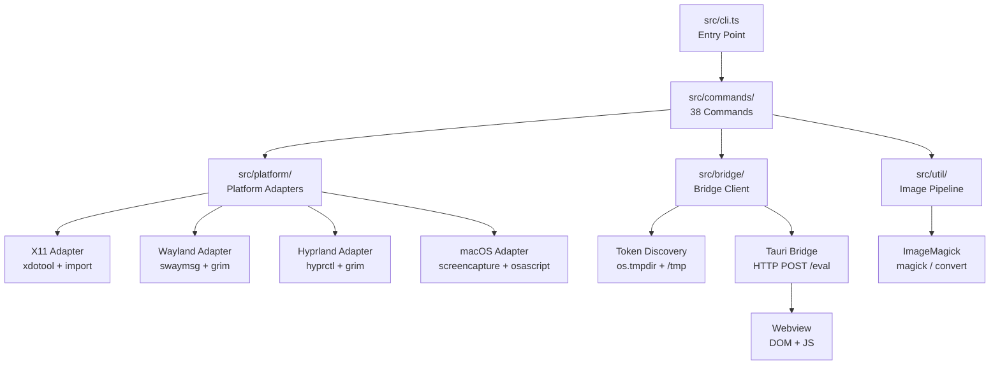

# Architecture Overview

## High-Level Architecture



## Module System

- **ESM** with `"type": "module"` in `package.json`
- **NodeNext** module resolution — all imports use `.js` extensions
- TypeScript compiles to `dist/` with declarations

## Entry Point

`src/cli.ts` creates the `commander` program and registers all 38 commands. It also manages:

- **Platform adapter creation** via `getAdapter(operation)` — lazy initialization and checks for `inspect`, `capture`, or `image` operations
- **Fatal errors** — shared error codes/messages/hints, with JSON on stderr when requested
- **Display server detection** — delegates to `detectDisplayServer()` in `src/platform/detect.ts`

## Command Pattern

Each command file exports a `registerXxx(program, ...)` function:

- **Platform-dependent commands** (`screenshot`, `info`, `wait`, `list-windows`) receive `getAdapter` as a parameter
- **Bridge-dependent commands** (`dom`, `eval`, `ipc-monitor`, `console-monitor`, `storage`, `page-state`, `mutations`, `click`, `type`, `scroll`, `focus`, `navigate`, `select`, `invoke`, `capture`, `check`, `store-inspect`) use `resolveBridge()` from `shared.ts`
- **Both** (`screenshot` with `--selector`, `wait`, `snapshot`) use both adapter and bridge
- **Local-only commands** (`diff`) operate on local files with no bridge or adapter
- **Optional bridge** (`probe`) works standalone but provides richer output with a bridge

`src/commands/shared.ts` provides shared utilities:

- `addBridgeOptions(cmd)` — adds `--port`, `--token`, `--pid`, and `--window-label` options to a command
- `resolveBridge(opts)` — auto-discovers or uses explicit bridge config, returns `BridgeClient`

`src/commands/interact/shared.ts` provides the interaction-command helpers:

- `addInteractOptions(cmd)` — extends `addBridgeOptions` with `--json` flag for interaction commands
- `addVerifyOptions(cmd)` — adds `--verify-timeout <ms>` (default 500, range 0–4000) to `type` and `select`
- `buildSetValueScript()` / `parseInteractResult()` — native-setter write + verification script builder and result parser used by `type` and `select`

## Platform Adapter Interface

All adapters implement the `PlatformAdapter` interface from `src/types.ts`:

```typescript
interface PlatformAdapter {
  findWindow(title: string): Promise<string>;
  captureWindow(windowId: string, format: ImageFormat): Promise<Buffer>;
  getWindowGeometry(windowId: string): Promise<WindowInfo>;
  getWindowName(windowId: string): Promise<string>;
  listWindows(): Promise<WindowInfo[]>;
}
```

Adapters are in `src/platform/`:

| Adapter | File | Tools |
|---------|------|-------|
| X11 | `x11.ts` | `xdotool`, ImageMagick (`import`) |
| Wayland | `wayland.ts` | `swaymsg`, `grim` |
| Hyprland | `hyprland.ts` | `hyprctl`, `grim` |
| macOS | `macos.ts` | `screencapture`, `osascript`, `sips` |

All adapters use ImageMagick for crop/resize operations via `src/util/image.ts`. The `magickCommand()` resolver in `src/util/magick.ts` auto-detects v6 (`convert`) vs v7 (`magick`) at runtime.

## Bridge Client

`src/bridge/client.ts` provides the `BridgeClient` class:

- `eval(js, timeout?)` — evaluate JS in the webview via HTTP POST
- `getElementRect(selector)` — get `getBoundingClientRect()` for an element
- `getViewportSize()` — get `window.innerWidth/innerHeight`
- `getDocumentTitle()` — get `document.title`
- `getAccessibilityTree(selector, depth)` — walk the accessibility tree
- `fetchLogs(timeout?)` — drain Rust log entries from the `/logs` endpoint
- `fetchLogs({cursor, waitMs, limit, timeoutMs})` — non-draining cursor read (v0.8 bridge), returns `{entries, cursor, dropped}`
- `ping()` — check if the bridge is reachable

## Token Discovery

`src/bridge/tokenDiscovery.ts` handles bridge auto-discovery:

1. Scan both Node's `os.tmpdir()` and `/tmp/` for files matching `tauri-dev-bridge-*.token` — the Rust bridge writes to `/tmp`, but on macOS `os.tmpdir()` returns `/var/folders/.../T/`, so both paths are checked
2. Parse each as JSON: `{ port, token, pid }`
3. Check PID liveness via `process.kill(pid, 0)`
4. Remove stale token files from dead processes
5. Within each directory, sort live bridges by token-file mtime (newest first, filename tie-break) and return the newest live bridge from the first directory that has one — with several bridge-enabled apps running, the CLI attaches to the most recently started one

Also exports `discoverBridgesByPid()` for `list-windows` to map PIDs to bridge configs.

## Image Pipeline

`src/util/image.ts` handles image processing:

- `cropImage(buffer, rect, format)` — crops via ImageMagick stdin/stdout
- `resizeImage(buffer, maxWidth, format)` — resizes via ImageMagick stdin/stdout
- `computeCropRect(elementRect, viewport, windowGeometry)` — computes the crop region accounting for window decorations

`src/util/exec.ts` provides the secure `exec()` wrapper:

- Uses `execFile()` with array arguments (never shell strings)
- `validateWindowId()` enforces `/^\d+$/` pattern
- 100MB max buffer for large screenshots

## Key Source Locations

| Location | Purpose |
|----------|---------|
| `src/cli.ts` | Entry point — registers commands |
| `src/types.ts` | Shared types |
| `src/commands/shared.ts` | Bridge option wiring |
| `src/commands/interact/shared.ts` | Interaction option wiring, native-setter write/verify scripts |
| `src/platform/detect.ts` | Display server detection |
| `src/bridge/client.ts` | HTTP bridge client |
| `src/bridge/tokenDiscovery.ts` | Token file scanning |
| `src/util/image.ts` | ImageMagick crop/resize operations |
| `src/util/magick.ts` | ImageMagick v6/v7 version detection |
| `src/util/exec.ts` | Secure process execution |

## Shared evaluation and collector helpers

`bridge/evaluate.ts` evaluates in the webview’s global context, awaits promises, and preserves typed results and original truthiness in a JSON-text envelope. It distinguishes thrown exceptions from ordinary strings beginning with `ERROR:`.

`bridge/observers.ts` gives console and IPC subscribers independent bounded buffers, and creates separate mutation observers per selector/session. Safe snapshots bound payload sizes without invoking getters. `bridge/logReader.ts` gives each Rust log consumer its own v0.8 cursor, detecting older drain-only bridges by response shape.

`util/monitor.ts` provides signal scopes spanning setup through cleanup, polling with a final sample, and an explicit interruption result. Checks fail when observation is incomplete; captures report partial evidence and warnings.

`errors.ts` is a dependency-free leaf shared by CLI, commands, bridge, and utilities. `scripts/check-imports.mjs` enforces the dependency graph as part of lint. The example bridge is compiled and tested separately with its committed Cargo lockfile; it is not part of the TypeScript build.
