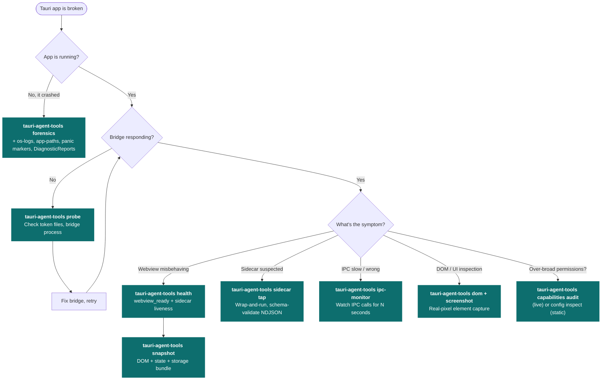

# Decision tree: which command for which symptom?

When something's wrong with a Tauri app, the first 30 seconds matter. They decide whether you spend the next hour reading the right logs or the wrong ones. This page maps symptoms to the right `tauri-agent-tools` command.

## When in doubt: `diagnose`

If you don't know where to start, run:

```bash
tauri-agent-tools diagnose --config ./src-tauri -o ./diagnose-out
```

`diagnose` is a best-effort super-command. It works on dead apps. It uses the bridge if one is available, and degrades cleanly if not. The output `summary.md` will point you at the right deeper command.

## The flowchart



## Symptom → command (table form)

Pick the row that matches what's broken. Commands marked **(bridge-free)** work even when the app has crashed or the bridge isn't running.

| Symptom | First command |
|---|---|
| Don't know what's wrong | `tauri-agent-tools diagnose -o ./diag` **(bridge-free, best-effort)** |
| App crashed at startup | `tauri-agent-tools forensics --config ./src-tauri -o ./forensics` **(bridge-free)** |
| App running, bridge isn't responding | `tauri-agent-tools probe` |
| App + bridge up, webview looks wrong | `tauri-agent-tools health --json` *(needs bridge v0.7+)* |
| Sidecar process is the suspect | `tauri-agent-tools sidecar tap --schema ./schema.json -- <cmd>` **(bridge-free)** |
| Which files does the app touch? | `tauri-agent-tools app-paths --config ./src-tauri --exists` **(bridge-free)** |
| Audit Tauri capabilities | `config inspect` (static) **or** `capabilities audit` (live) |
| OS-level error in Console.app / journalctl | `tauri-agent-tools os-logs --identifier com.example.app --level error --duration 30000` **(bridge-free)** |
| Get inspector / devtools URL | `tauri-agent-tools webview attach` *(needs bridge v0.7+)* |
| What sidecars did the app spawn? | `tauri-agent-tools process-tree --json` *(needs bridge v0.7+)* |

## Bridge-free vs bridge-required

Commands fall into two camps:

**Bridge-free** — work on any Tauri 2 app, including release builds and crashed processes:
`diagnose`, `forensics`, `app-paths`, `config inspect`, `os-logs`, `sidecar tap`, `sidecar replay`, plus `list-windows`, `info`, `diff`.

**Bridge-required** — need the dev bridge running inside a debug build:
`screenshot --selector`, `dom`, `eval`, `wait --selector`, `ipc-monitor`, `console-monitor`, `rust-logs`, `storage`, `page-state`, `mutations`, `snapshot`, `click`, `type`, `scroll`, `focus`, `navigate`, `select`, `invoke`, `capture`, `check`, `store-inspect`, `process-tree`, `capabilities audit`, `webview attach`, `health`.

The four v0.7+ bridge commands feature-detect via `GET /version` — they emit a clear "requires bridge v0.7.0+, re-copy `dev_bridge.rs`" error against older bridges rather than failing with an opaque HTTP 404.

## Platform caveats

- **Windows** — `os-logs` is stubbed in v0.7; the Windows event log adapter is planned. `forensics` and `diagnose` still produce useful bundles on Windows, they just skip the live OS-log tail.
- **Tauri 1** — `app-paths` encodes Tauri 2's `PathResolver` semantics. Tauri 1's paths differ slightly; expect minor drift in derived directories.
- **Release builds** — the dev bridge requires `cfg!(debug_assertions)`. Use bridge-free commands for signed/notarized release artifacts.
